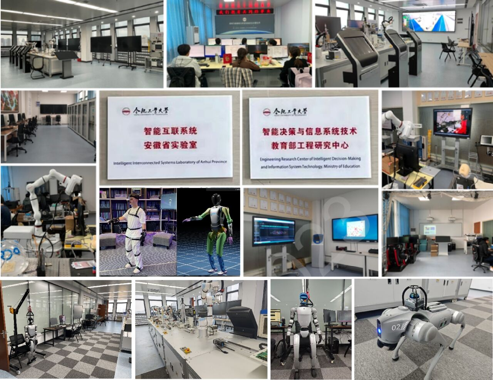

# 实验室主页

我们致力于开发视觉语言行动（VLA）大模型和具身智能技术，推动下一代异构多智能体协作与智能柔性制造系统的发展。

---

## 🎓 研究方向

- 异构机器人数据采集  
- 机械臂抓取  
- 多智能体类人运动迁移  
- 灵巧手感知与控制  
- 多智能体群控  

---

## 🎓 团队成员

- Yanjiu Zhong — zhongyanjiu@hfut.edu.cn  
- Jian Sun — 1218679064@qq.com  
- Yang Wang — brownyangw@gmail.com  
- Shuai Chen — 2024111074@mail.hfut.edu.cn  
- Linfeng Li — llf_ah@163.com  
- Xianpeng Li — 2411441061@qq.com  
- Xincheng Han — 3301625791@qq.com  
- Shirong Luo — 2447816975@qq.com  
- Jinyang Zhao — 2023213574@mail.hfut.edu.cn  
- Yuanjun Yang — 2023211121@mail.hfut.edu.cn  
- Chengzheng Sun — 1449335205@qq.com  

---

## 📝 研究进展与项目简介

### 数据采集系统  
基于VR的异构机器人数据采集系统，支持多模态、多场景、多任务数据采集，助力VLA模型训练。

### 多模态驱动的机械臂决策  
融合视觉和触觉信息，实现机械臂的智能决策与精准控制。

### 基于强化学习的人类运动迁移  
实现人类动作的高效模拟迁移，提升多智能体协同能力。

### 灵巧手触觉感知系统  
结合柔性电子皮肤，增强灵巧手的多模态感知与自主控制。

### 异构机器人群智能导航  
基于强化学习的动态路径规划，实现复杂环境下多机器人协作导航。

---

## 🛠️ 进行中的项目

- 太空具身智能机器人认知强化与系统演化  
- 多智能体协同调度与柔性制造系统  
- 基于大模型的智能电机装配辅助系统  
- 城市作战异构机器人协同决策  
- 航空航天移动机械臂智能抓取系统  

---

## 🧪 实验设施

---

## 🏛️ 合作单位

### 学术合作  
- 清华大学  
- 上海交通大学  
- 南京大学  
- 阿尔伯塔大学  

### 产业合作  
- 中国航天科技集团（CAST）  
- 成都飞机工业集团（AVIC Chengfei）  
- 中国航空发动机集团（AECC）  
- 中国宝武钢铁集团  
- 中国北方工业集团有限公司（中国兵器工业集团）  
- 安徽三合一信息技术有限公司  
- 奇瑞汽车有限公司  

---

欢迎关注与合作！  

